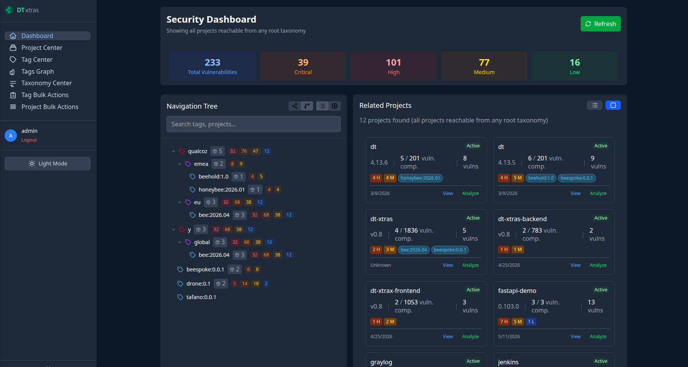

# dt-xtras - Dependency-Track Extensions

*A set of features that complement Dependency-Track from the outside.*

## 🎯 About

The project provides a set of features that complement Dependency-Track.

The taxonomy system categorizes project tags and defines semantic relationships between them,
enabling both direct categorization and inferred labeling through graph-based relationships.

Bulk actions provide a way to activate/deactivate/delete multiple projects at once, and to
apply/remove/clone tags for multiple projects at once.

### Rationale

The project was created to address the need for more flexible project organization and classification in Dependency-Track.
While Dependency-Track provides basic project tagging and properties, this extension allows for:

- **Hierarchical Classification**: Create complex taxonomies with multiple levels of categorization
- **Inferred Labeling**: Automatically classify projects based on tag patterns and relationships
- **Bulk Operations**: Manage multiple projects and tags efficiently through bulk actions
- **Custom Views**: Create brand, region, product, customer, environment or any other-centric views over your portfolio
- **Mixed Hierarchies**: Combine multiple taxonomies for complex organizational views

Should any feature implemented here be considered for inclusion in the main Dependency-Track project,
it will probably be deprecated in favor of a more integrated approach.

#### Tag Patterns (Examples)

Combine bundles on regions for brands:
- `brand:qualcoz` → Brand classification: QUALCOZ Ltd
- `region:eu` → Region classification: EU
- `bee:2026.05` → Bundle version classification: BEE version 2026.05
- `site:qualcoz:eu:bee:2026.05` → A site serving Brand QUALCOZ Ltd for
Region EU using the software Bundle BEE version 2026.05

In the example above, the tag `brand:qualcoz:eu:bee:2026.05` provides all projects tagged as `bee:2026.05` with the following classifications:
- Brand: QUALCOZ Ltd
- Region: EU
- Bundle: BEE
- Version: 2026.05

Combine environments, customers, and product versions:
- `env:staging` → Environment classification: staging
- `customer:acme` → Customer classification: ACME Inc
- `myapp:1.0.0` → Product version classification: MYAPP version 1.0.0
- `deploy:acme:prod:myapp:1.0.0` → Customer ACME Inc + Environment PROD + Product MYAPP version 1.0.0

In the example above, the tag `deploy:acme:prod:myapp:1.0.0` provides all projects tagged as `myapp:1.0.0` with the following classifications:
- Customer: ACME Inc
- Environment: PROD
- Product: MYAPP
- Version: 1.0.0

### Hierarchy Building

1. Projects are fetched from Dependency-Track API
2. Taxonomies are applied in priority order (lower numbers first)
3. Regex patterns extract values using named capture groups
4. Tag relationships are established based on capture group names and order
5. Security metrics are rolled up from leaf nodes (projects) to root

### Security Metrics

- **Vulnerabilities**: Total count of vulnerabilities
- **Severity Breakdown**: Critical, High, Medium, Low counts
- **Risk Score**: Average inherited risk score from child nodes
- **DT-style Bars**: Visual representation matching Dependency-Track UI

## License

This project complements Dependency-Track, hence follows the same licensing terms.

## Disclaimer

This is a personal project that strives to be a community project:
it is **not endorsed by, affiliated with, or officially supported by Dependency-Track or any of its associated projects, companies, or organizations.**

### Project Status
- **Alpha**: This project is in early development (raw implementation, missing paging, missing tests, missing documentation)
- **Community Driven**: Developed and maintained by the open-source community
- **Independent Addition**: Complements Dependency-Track functionality but is not part of the official Dependency-Track codebase
- **Use at Your Own Risk**: Users should thoroughly test and evaluate this extension before using in production environments
- **No Warranty**: This software is provided "AS IS" without warranties of any kind, either express or implied
- **No Official Support**: Support is provided through community channels (GitHub Issues, Discussions) only

### Relationship to Dependency-Track
- **Almost no storage**: All data is stored in Dependency-Track's database except for taxonomy definitions (a single YAML file)
- **Extension Only**: This project implements additional functionality outside of the core Dependency-Track application
- **API Integration**: Uses Dependency-Track's public APIs for data retrieval and processing
- **Compatibility**: Designed to work with Dependency-Track's existing data models and API endpoints
- **No Modification**: Does not require changes to Dependency-Track core functionality

### Trademarks
- **Dependency-Track®**: Is a registered trademark of OWASP Foundation
- **Project Name**: "dt-xtras" is not associated with or endorsed by the OWASP Foundation or Dependency-Track project
- **Third-Party References**: Any references to third-party products, services, or companies are for compatibility purposes only

### Contact and Support
- **Issues**: Report bugs, feature requests, or questions via [GitHub Issues](https://github.com/davidecavestro/dt-xtras/issues)
- **Discussions**: Community support and discussions via [GitHub Discussions](https://github.com/davidecavestro/dt-xtras/discussions)
- **Documentation**: Project documentation available in this repository
- **Community**: Contributions and improvements are welcome from the community

### Legal Notice
This project is provided as a community extension without any guarantee of compatibility, fitness for purpose, or reliability. Users assume all responsibility for its use and any consequences thereof.
